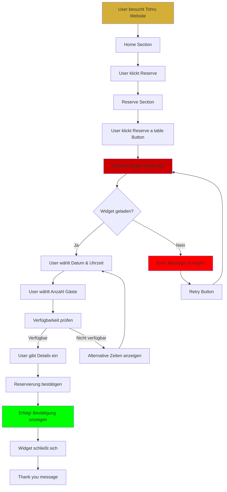
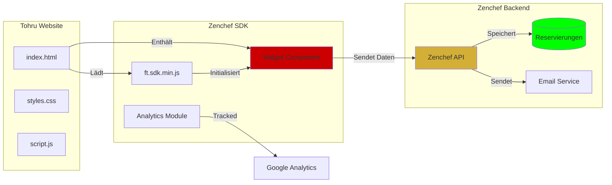
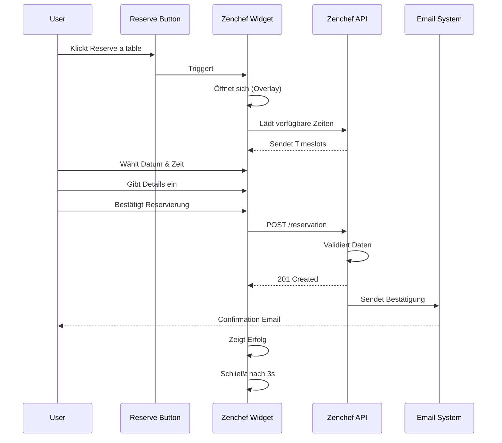
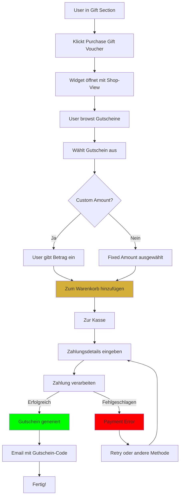
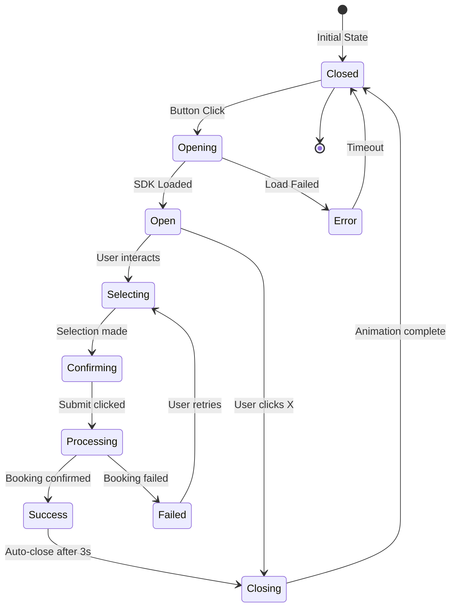
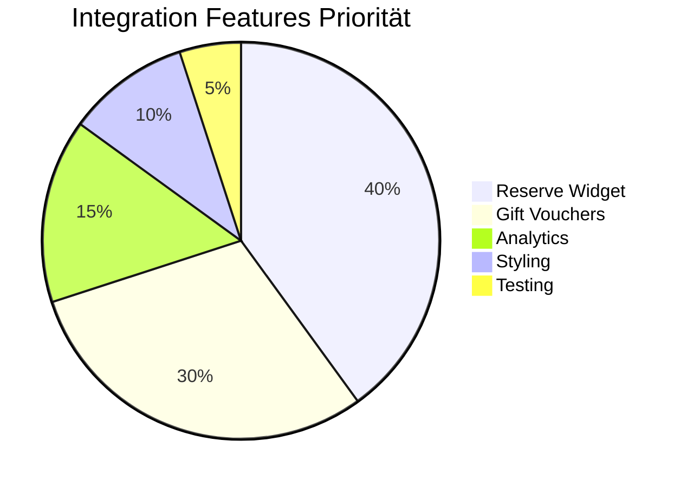

# Zenchef Widget - User Flow & Integration

## 🎯 User Flow Diagram

## 🎨 Integration Architecture

## 📱 Button Actions Flow

## 🔄 Gift Voucher Flow

## 🎭 Widget States

## 🚀 Implementation Steps

```mermaid
gantt
    title Zenchef Integration Timeline
    dateFormat  HH:mm
    axisFormat %H:%M
    
    section Setup
    SDK Script einfügen           :a1, 00:00, 2min
    Widget Container hinzufügen   :a2, after a1, 2min
    
    section Code Changes
    Reserve Button Update         :b1, after a2, 2min
    Gift Voucher Button Update    :b2, after b1, 2min
    Optional CSS Anpassungen      :b3, after b2, 3min
    
    section Testing
    Desktop Testing               :c1, after b3, 5min
    Mobile Testing                :c2, after c1, 5min
    Cross-Browser Testing         :c3, after c2, 5min
    
    section Verification
    Test Reservierung             :d1, after c3, 3min
    Backend Check                 :d2, after d1, 2min
    Analytics Verification        :d3, after d2, 3min
```

## 📊 Widget Configuration Options

| Option | Wert | Beschreibung | Empfehlung |
|--------|------|-------------|-----------|
| `data-restaurant` | `0b624972` | Restaurant ID | ✅ Erforderlich |
| `data-open` | `false` | Auto-Open beim Load | ✅ Aus lassen |
| `data-open-mobile` | `false` | Auto-Open Mobile | ✅ Aus lassen |
| `data-color` | `#d4af37` | Akzentfarbe | ✅ Gold (passend) |
| `data-language` | `de` | Widget-Sprache | ✅ Deutsch |
| `data-tag` | `tohru-website` | Tracking-Tag | ✅ Für Analytics |
| `data-toolbar` | `false` | Toolbar anzeigen | ✅ Aus (Button besser) |
| `data-toolbar-mobile` | `false` | Mobile Toolbar | ✅ Aus |

## 🎯 Integration Priorities

## ✅ Success Metrics

Nach erfolgreicher Integration sollte folgendes funktionieren:

### Desktop
- [x] Widget öffnet bei Button-Click
- [x] Widget lädt in < 2 Sekunden
- [x] Reservierung kann durchgeführt werden
- [x] Gift Voucher Shop öffnet
- [x] Widget hat korrekte Farbe
- [x] Widget ist auf Deutsch
- [x] Widget kann geschlossen werden
- [x] Keine JavaScript-Errors

### Mobile
- [x] Widget öffnet fullscreen
- [x] Touch-optimiert
- [x] Keine Scroll-Probleme
- [x] Close-Button erreichbar
- [x] Formulare funktionieren

### Analytics (falls GA aktiv)
- [x] Widget Open Events getrackt
- [x] Reservierungen getrackt
- [x] E-Commerce Events getrackt

---

**Visual Documentation:** Flow Diagrams & Architecture  
**Status:** Ready for Implementation  
**Estimated Time:** 30 minutes  
**Complexity:** ⭐⭐☆☆☆ (Easy)
